# CityofLA_data_analysis project
this is my attempt at the CityofLA data analysis competition on kaggle using the kernals as a helping hand

The goal is to convert a folder full of plain-text job postings into a single structured CSV file and then to use this data to: (1) identify language that can negatively bias the pool of applicants; (2) improve the diversity and quality of the applicant pool; and/or (3) make it easier to determine which promotions are available to employees in each job class.

### Table of Contents
- [Getting Started](#getting-started)
  - [Prerequisites](#prerequisites)  
- [Deployment Process](#deployment-process)
  - [Converting Plain-Text to CSV ](#converting-plain-text-to-csv) 
  - [Identifying trends and traits](#identifying-trends-and-traits)
    - [Creating job sectors](#creating-job-sectors)
    - [Salary analysis](#salary-analysis)
    - [Opportunities over the years](#opportunities-over-the-years)
    - [Experience vs Education](#experience-vs-education)
    - [Bulletin availablity](#bulletin-availablity)
    - [Checking for gender bias](#checking-for-gender-bias)
    - [FleschKincaid Grade Level(Readabilty measure)](#fleschkincaid-grade-level)
    - [Checking for promotions and similar jobs](#checking-for-promotions-and-similar-jobs)

- [Conclusions](#conclusions)  
- [Suggestions](#suggestions)  
- [Acknowledgments](#acknowledgments) 


## Getting Started

### Prerequisites
you can download the bulletin and additional files from the kaggle competition page for the city of LA.
This analysis is performed using python therefore, to run this on your system you will need a copy of python installed. I recommend getting an IDE such as PYCHARM.
The libraries required are:<br/>
Pandas: for the dataframes<br/>
IPython: to diplay the dataframes<br/>
re: for the regex templates<br/>
numpy:for the "NAN" constant<br/>
datetime: to extract date and time from the text files<br/>
matplotlib: for plotting<br/>
nltk: to perform word processing analytics<br/>
seaborn:for plotting<br/>
collections:for the counter function<br/>
scipy:for calculating line regression<br/>
os:to create a list of the bulletin text file names<br/>

## Deployment Process

### Converting Plain-Text to CSV 
first to convert the folder of plain-text job postings we need to identify a pattern present in these text file so we can extract meaninigful data using regex templates. Going through some of the text files we can see recurring patterns such as all the headlines are in caps and have the same order in all the job bulletins.
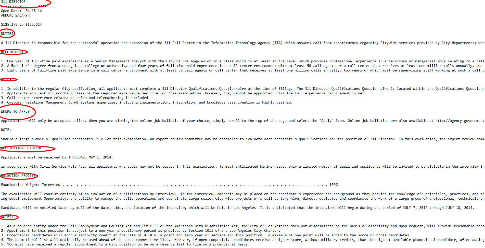
we can extract these headings and use them as columns in our CSV:
the Open date or the date the job was posted is also written in the same place in each bulletin. Analyzing these traits we can write a function to_dataframe to extract all the meaningful data from the text files:
```python
def to_dataframe(path):
    """"function to extract all meaningful features from job bulletin text files and convert to
    pandas dataframe.
     function takes one argument:
                        a string containing path of the bulletin text files
                                        """
    bulletins=os.listdir(path)
    num=len(bulletins)
    opendate = re.compile(r'(Open [D,d]ate:)(\s+)(\d\d-\d\d-\d\d)')  # match open date

    salary = re.compile(r'(\$\d+,\d+)((\s(to|and)\s)(\$\d+,\d+))?((\s(and)\s)(\$\d+,\d+)((\s(to|and)\s)(\$\d+,\d+)))?')  # match salary

    requirements = re.compile(r'(REQUIREMENTS?/\s?MINIMUM QUALIFICATIONS?)(.*)(PROCESS NOTE)')  # match requirements

    for no in range(num):
        with open(path+bulletins[no]) as f:  # looping through reading each file
            try:
                
                file = f.read().replace('\t', '')#removing large spaces for headings extraction
                data = file.replace('\n', '')#removing line breaks for content
                headings = [heading for heading in file.split('\n') if
                            heading.isupper()]  ##getting headings from job bulletins

                try:
                   date = datetime.strptime(re.search(opendate, data).group(3), '%m-%d-%y')#match open date
                except Exception as e:
                    print(no)#error diagnosis
                try:
                   sal = re.search(salary, data)
                except Exception as e:
                   print(bulletins[no])
                try:
                    req = re.search(requirements, data).group(2)
                except Exception as e:
                    req = re.search('(.*)NOTES?', re.findall(r'(REQUIREMENTS?)(.*)(NOTES?)',
                                                             data)[0][1][:1200]).group(1)#second type of requirement extraction

                duties = re.search(r'(DUTIES)(.*)(REQ[A-Z])', data).group(2)#matching duties
                try:
                    enddate = re.search(
                        r'(JANUARY|FEBRUARY|MARCH|APRIL|MAY|JUNE|JULY|AUGUST|SEPTEMBER|OCTOBER|NOVEMBER|DECEMBER)\s(\d{1,2},\s\d{4})'
                        , data).group()#best formulated end date match
                except Exception as e:
                    enddate = np.nan

                selection = [z[0] for z in re.findall('([A-Z][a-z]+)((\s\.\s)+)', data)]  ##match selection criteria
                if  sal.group(9) is None:#checking for alternative starting salary
                    saler=np.nan
                else:
                    saler=str(sal.group(9))
                if  sal.group(13) is None:#checking for alternative ending salary
                    saler2=np.nan
                else:
                    saler2=str(sal.group(13))

                df = df.append(
                    {'File Name': bulletins[no], 'Position': headings[0].lower(), 'salary_start': sal.group(1),'salary_start_alt': saler,
                     'salary_end': sal.group(5),'salary_end_alt': saler2, "opendate": date, "requirements": req, 'duties': duties,
                     'deadline': enddate, 'selection': selection}, ignore_index=True)
            except Exception as e:
                               print('umatched sequence'+bulletins[no])
    reg = re.compile(
        r'(One|Two|Three|Four|Five|Six|Seven|Eight|Nine|Ten|one|two|three|four)\s(years?)\s(of\sfull(-|\s)time)')#best formuated experience match
    df['EXPERIENCE_LENGTH'] = df['requirements'].apply(
        lambda x: re.search(reg, x).group(1) if re.search(reg, x) is not None else np.nan)
    df['FULL_TIME_PART_TIME'] = df['EXPERIENCE_LENGTH'].apply(
        lambda x: 'FULL_TIME' if x is not np.nan else np.nan)

    reg = re.compile(
        r'(One|Two|Three|Four|Five|Six|Seven|Eight|Nine|Ten|one|two|three|four)(\s|-)(years?)\s(college)')#best education years match

    df['EDUCATION_YEARS'] = df['requirements'].apply(
        lambda x: re.search(reg, x).group(1) if re.search(reg, x) is not None else np.nan)
    df['SCHOOL_TYPE'] = df['EDUCATION_YEARS'].apply(
        lambda x: 'College or University' if x is not np.nan else np.nan)
    reg2 = re.compile(
        r"(semester|Semester|quarter units|college|College|university|University|Bachelor's|bachelor's|Bachelor|bachelor|Master's|master's)")#second criteria for school type
    for index, row in df.iterrows():
        if row['SCHOOL_TYPE'] is np.nan:
            if re.search(reg2, row['requirements']) is not None:
                df.loc[index, 'SCHOOL_TYPE'] = 'College or University'

    return df
```
An example of executing this function would be:
```python

path="C:/Users/twist/CityofLA/Job Bulletins/"
df=to_dataframe(path)
df.to_csv('jobs_output.csv')#output to csv
```
We can then view the csv file

as can be seen most of the data from the job bulletins has been captured. By printing the shape of the data frame we can know the exact number of entries
```
print(df.shape)

(665, 15)
```
665 out of the initial 683 are extracted now we can perform analysis on them.


### Identifying trends and traits
#### creating job sectors
By analyzing reoccuring words in the job title we can make out the differant job sectors available in the city of LA. We can then create a plot of the top 10 to figure out the most dominant.
```python

plt.figure(figsize=(8,5))
text=''.join(job for job in df['Position'])                                ##joining  data to form text
text=nltk.tokenize.word_tokenize(text)
job_class_final=list() ##counting number of occurences
checker=text.copy()
for b in range(20):
    jobs = Counter(checker)
    jobs_class=[job for job in jobs.most_common() if len(job[0])>3]          ##selecting most common words
    job_class_final.append(jobs_class[0])
    black=list()
    for y in checker:
        if y.find(jobs_class[0][0])== -1:                              # finding those that do not match the criteria
            black.append(y)                                            # creating a list out of them to rerun the test 
    checker=black

a,b=map(list, zip(*job_class_final))                                       ## seperating the tuple into two different variables
sns.barplot(b,a,palette='rocket')                                           ##creating barplot
plt.title('Job sectors')
plt.xlabel("count")
plt.ylabel('sector')
plt.show()
```
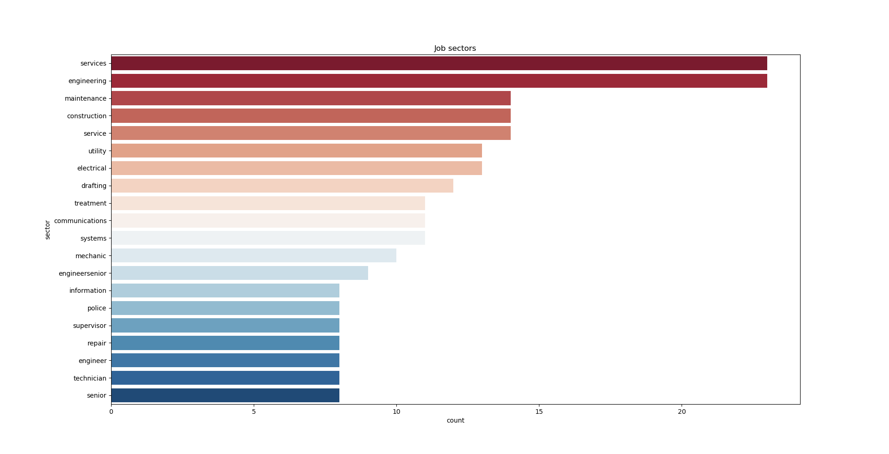
As seen from the bar plot the most dominant sectors are engineering and services.
#### salary analysis
to analyze the salary satistics we must first convert in to pure numbers removing the comas and the dollar signs
```python

df['salary_start']=[sal.replace('$','')  if sal!= None else 0 for sal in df['salary_start']  ]
df['salary_start']=[int(sal.split(',')[0]+sal.split(',')[1] ) if type(sal)!=int else 0 for sal in df['salary_start']]
df['salary_end']=[sal.replace('$','')  if sal!= None else 0 for sal in df['salary_end']  ]
df['salary_end']=[int(sal.split(',')[0]+sal.split(',')[1] ) if type(sal)!=int else 0 for sal in df['salary_end']]

df['salary_start_alt']=[str(pal).replace('$','')  if pal is not None else 0 for pal in df['salary_start_alt']  ]
df['salary_start_alt']=[int(sal.split(',')[0]+sal.split(',')[1] ) if type(sal)!=int and sal!="nan" else 0  for sal in df['salary_start_alt']]
df['salary_end_alt']=[str(sal).replace('$','')  if sal is not None and not float() else 0 for sal in df['salary_end_alt']  ]
df['salary_end_alt']=[int(sal.split(',')[0]+sal.split(',')[1] ) if type(sal)!=int  and sal!="nan" else 0 for sal in df['salary_end_alt']]
```
we can then plot the distribution of salaries of all the jobs to see how they vary
```
plt.figure(figsize=(7,5))
sns.distplot(df['salary_start'])
plt.title('salary distribution')
plt.show()
```
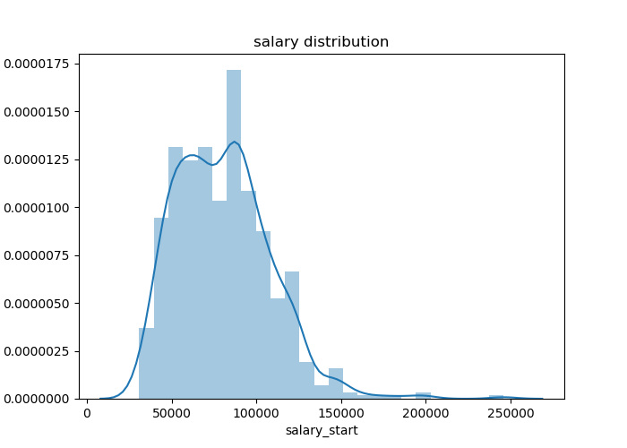
As seen from the plot that the salaries vary from 40k to 150k with the average around 80k.
we can also check for the highest paid jobs and the jobs that have the highest deviation from start to end salary
```python

most_paid=df[['Position','salary_start']].sort_values(by='salary_start',ascending=False)[:10]
plt.figure(figsize=(7,5))
sns.barplot(y=most_paid['Position'],x=most_paid['salary_start'],palette='rocket')
plt.title('Best paid jobs in LA')
plt.show()
```
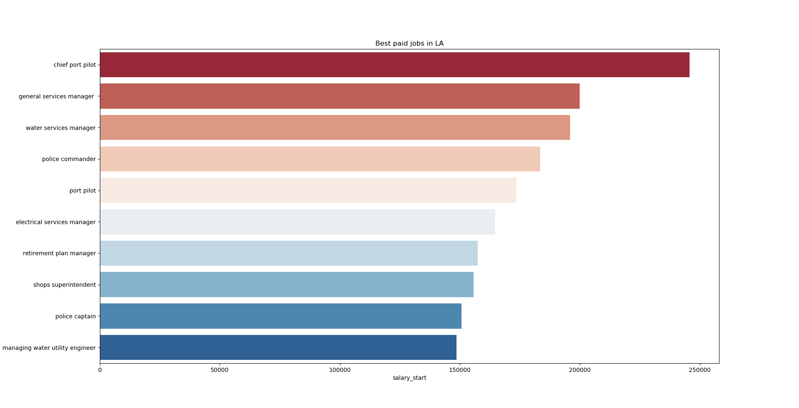
the largest job market might be engineering but the highest paid jobs come from the services sector and shipping and port sector

```python

test=pd.DataFrame(columns=['salary_diff','salary_diff_alt'])
#test['salary_diff']=[abs(row['salary_start']-row['salary_end_alt']) if row['salary_end_alt']!="nan" else abs(row['salary_start']-row['salary_end']) for index, row in df.iterrows()  ]
test['salary_diff_alt']=abs(df['salary_start_alt']-df['salary_end_alt'])
test['salary_diff']=abs(df['salary_start']-df['salary_end'])
df['salary_diff']=[row['salary_diff'] if row['salary_diff']> row['salary_diff_alt']  else row['salary_diff_alt'] for index, row in test.iterrows()  ]
ranges=df[['Position','salary_diff']].sort_values(by='salary_diff',ascending=False)[:10]
plt.figure(figsize=(7,5))
sns.barplot(y=ranges['Position'],x=ranges['salary_diff'],palette='RdBu')
plt.title("Highest deviation")
plt.show()
```
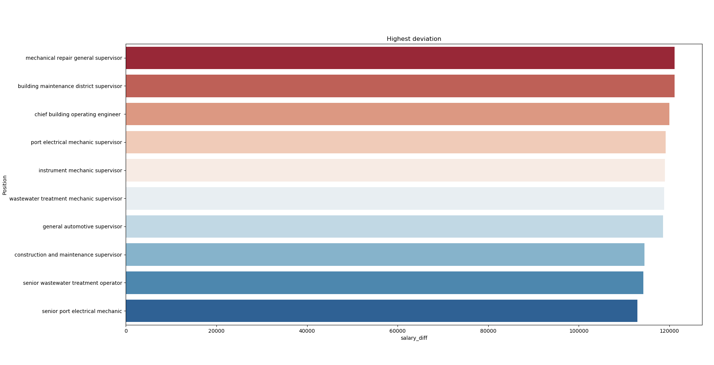
Mechanical repair general supervisor job has the highest deviation. it is clear from this that a supervisor position has the most salary growth without the need for a promotion.
#### Opportunities over the years
we can check for the fluctuation in the job market over the years by analyzing the open date of the job listings
```python

df['year_of_open']=[date.year for date in df['opendate']]

count=df['year_of_open'].value_counts(ascending=True)
years=['2020','2019','2018', '2017', '2016', '2015', '2014', '2013', '2012', '2008', '2006',
           '2005', '2002', '1999']
plt.figure(figsize=(7,5))
plt.plot([z for z in reversed(years)],count.values,color='blue')

plt.title('Oppurtunities over years')
plt.xlabel('years')
plt.ylabel('count')
plt.gca().set_xticklabels([z for z in reversed(years)],rotation='45')
plt.show()
```
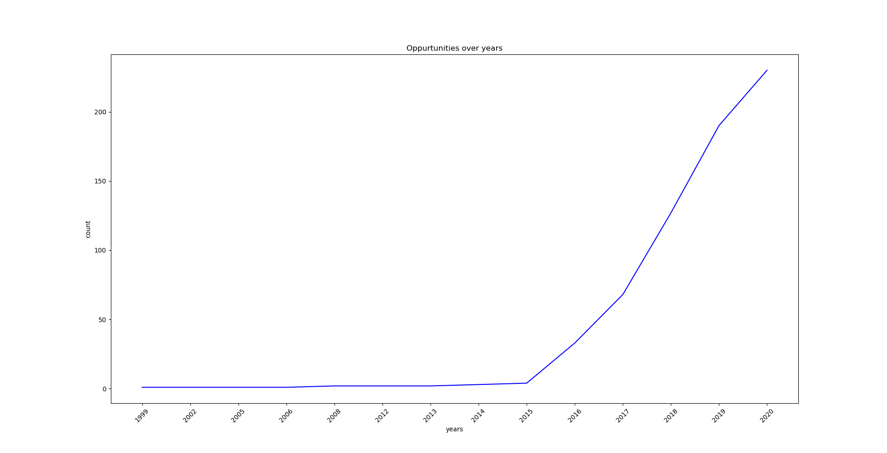
The opportunities seem to be rising as a whole.
We can also check how the top 10 sectors have changed induvidually over the years
```python

years2=df[['Position','year_of_open']].copy()

years2=years2.sort_values(by='year_of_open',ascending=False)
for index,row in years2.iterrows():
    for x,y in job_class_final:
        if row['Position'].find(x)!=-1:
            years2.loc[index, 'sector'] =x
            break
        else:
            years2.loc[index, 'sector'] =np.nan
plt.figure(figsize=(7, 5))
    plt.plot([z for z in reversed(years)], counter[::-1],label=x)
plt.title('Oppurtunities over years')
plt.xlabel('years')
plt.ylabel('count')
plt.gca().set_xticklabels([z for z in reversed(years)],rotation='45')
plt.legend(loc='upper left')
plt.show()
```
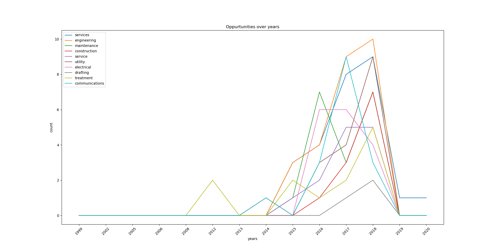
We can also check the fastest growing sectors in the city 
```python

sectory=list()
slopy=list()
for x,y in job_class_final[:][:10] :
    #ploter=[int(row['year_of_open']) if row['sector']==x else np.nan for index,row in years2.iterrows()]
    plotter = years2[years2['sector'] == x]
    plotter=plotter.groupby(['year_of_open']).size().reset_index(name='Size')
    counter=list()
    display(plotter.dtypes)
    for ye in years:
        sizer=len(counter)
        for index,row in plotter.iterrows():

          if int(ye) == int(row['year_of_open']) :
              counter.append(row['Size'])
              break

        if sizer==len(counter):
            counter.append(0)
    sloperr, intercept, r_value, p_value, std_err = linregress(list(map(int, years[1:11][::-1])), counter[1:11][::-1])
    print(sloperr)
    slopy.append(sloperr)
    sectory.append(x)
sloper=pd.DataFrame({'sector':sectory})
sloper['slope']=slopy
print(sloper)
plt.figure(figsize=(7,5))
sloper=sloper.sort_values(by='slope',ascending=False)
sns.barplot(y=sloper['sector'],x=sloper['slope'],palette='RdBu')
plt.title('fastest growing job sector as of 2018')
plt.show()
```
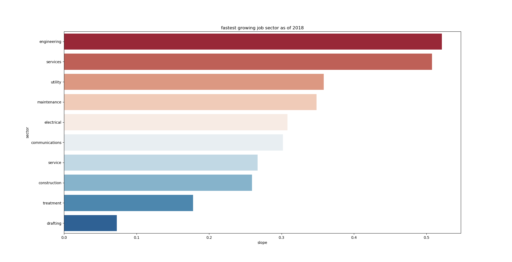
The fastest growing sector in the city is engineering and these results are inline with the largest sectors.
#### Experience vs Education
We can check what level of experience is required by the job bulletins:
```python

experience=df['EXPERIENCE_LENGTH'].value_counts().reset_index()
experience['index']=experience['index'].apply(lambda x : x.lower())
experience=experience.groupby('index',as_index=False).agg('sum')
labels=experience['index']
sizes=experience['EXPERIENCE_LENGTH']
plt.figure(figsize=(5,7))
plt.pie(sizes,explode=(0, 0.1, 0, 0,0,0,0),labels=labels)
plt.gca().axis('equal')
plt.title('Experience value count')
plt.show()
```
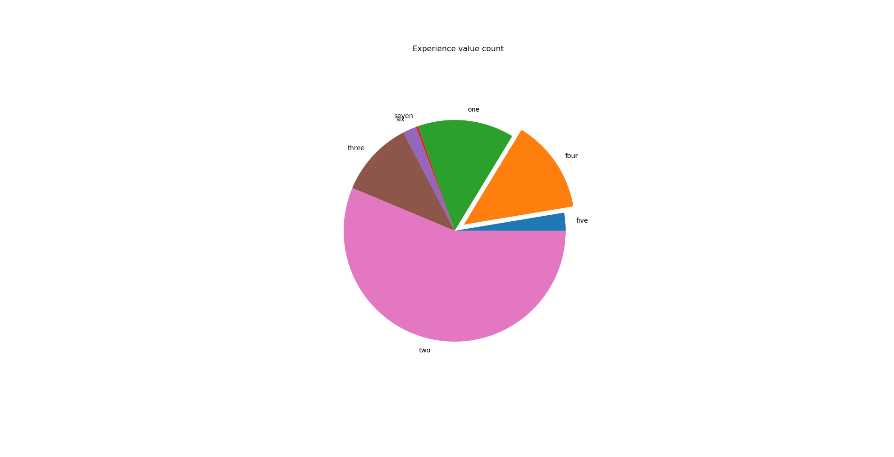
Most of the jobs require two years of experience
also wether education or experience is prefered:
```python

x1=df['SCHOOL_TYPE'].value_counts()[0]
x2=df['FULL_TIME_PART_TIME'].value_counts()[0]
plt.figure(figsize=(5,5))
plt.bar(height=[x1,x2],x=['College Degree','Experience'])
plt.show()
```
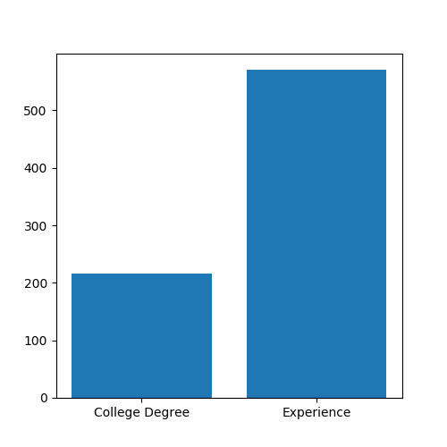
According to the listings most of the jobs prefer experience over a college degree

We can check the most common requirements by analyzing the words present in them
```python

token=nltk.tokenize.word_tokenize(req)
counter=Counter(token)
count=[x for x in counter.most_common(40) if len(x[0])>3]
print("Most common words in Requirement")
print(count)
plotc=count[:][:10]
a,b=map(list, zip(*plotc))est
sns.barplot(b,a,palette='rocket')                                           ##creating barplot
plt.title('most common requirements')
plt.xlabel("count")
plt.ylabel('requirements')
plt.show()

Most common words in Requirement
[('experience', 1211), ('paid', 945), ('full-time', 930), ('years', 850), ('with', 594), ('City', 418), ('Angeles', 416),
('level', 318), ('from', 274), ('year', 263), ('college', 256), ('accredited', 253), ('university', 218), ('class', 199), ('professional', 189), ('maintenance', 172), ('which', 169), ('units', 157)]

```
Experience is the most in demand where as college or unversity are not even present in the top 10
we can also see what most of the jobs use as screening processes:
```python

plt.figure(figsize=(7,7))
count=df['selection'].astype(str).value_counts()[:10]
sns.barplot(y=count.index,x=count,palette='rocket')
plt.gca().set_yticklabels(count.index,rotation='45')
plt.show()
```
#### Bulletin availablity
what months are the job offers available in:

```python

plt.figure(figsize=(7,5))
df['open_month']=[z.month for z in df['opendate']]
count=df['open_month'].value_counts(sort=False)
sns.barplot(y=count.values,x=count.index,palette='rocket')
month_name=['','january','february','march','april','may','june','july','august','september','october','november','december']
plt.gca().set_xticklabels([month_name[x] for x in count.index],rotation='45')
plt.show()
```
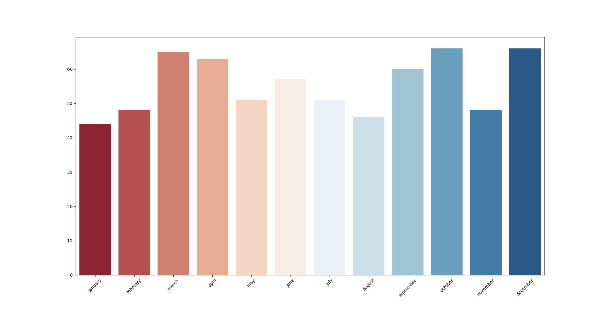
From this graph the jobs seem to be well distributed across the year
We can also see which of the job postings donot have an end date
```python

print('%d job applications may close without prior notice' %df['deadline'].isna().sum())

44 job applications may close without prior notice
```

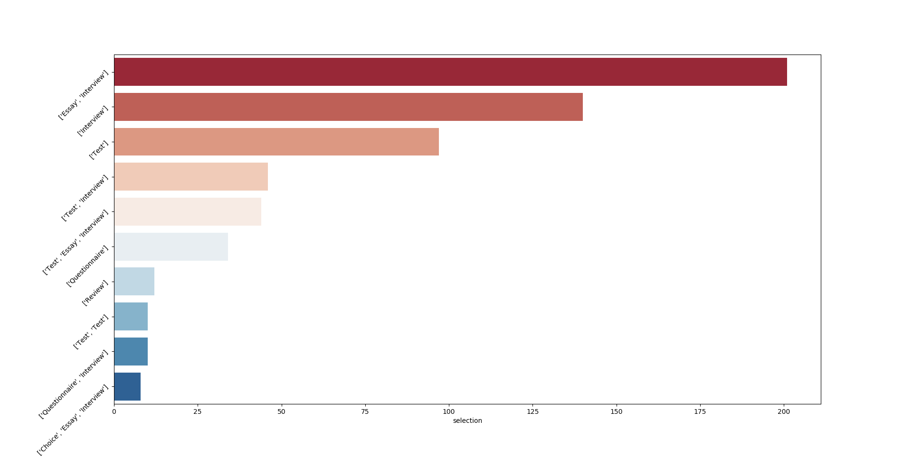
Most jobs only require an interview along with an essay
#### Checking for gender bias
We can also check pronoun usage to check gender bias
```python

def pronoun(data):
    '''function to tokenize data and perform pos_tagging.Returns tokens having "PRP" tag'''

    prn = []
    vrb = []
    token = nltk.tokenize.word_tokenize(data)
    pos = nltk.tag.pos_tag(token)

    vrb = Counter([x[0] for x in pos if x[1] == 'PRP'])

    return vrb


req_prn = pronoun(req)
duties= ' '.join(d for d in df['duties'])
duties_prn = pronoun(duties)
print('pronouns used in requirement section are')
print(req_prn.keys())
print('\npronouns used in duties section are')
print(duties_prn.keys())

pronouns used in requirement section are
dict_keys(['or2', 'or3', 'or4', 'orb', 'you', 'I', 'they', 'orc', 'or5', 'or6', 'or7', 'or8', 'You', 'it', 'orB', 'offset', 'ore.'])

pronouns used in duties section are
dict_keys(['they', 'it', 'You', 'I', 'you', 's', 'or2', 'They'])
```
The pronouns used are all gender nuetral
check for gender biased job listings such as 'policeman' or 'fireman'
```python

for name in df['Position']:
    z=re.match(r'\w+?\s?\w+(man|woman|men|women)$',name)
    x = re.match(r'\w+?\s?(man|woman|men|women|male|female)$', name)
    if z is not None:
        print(z)
    if x is not None:
        print(x)
        
        
 ```
 None found the job listings are completely unbiased
 #### FleschKincaid Grade Level
Designed to indicate how difficult a reading passage is to understand. The result is a number that corresponds with a U.S grade level.
FKGL = 0.39 * (total words/ total sentences) + 11.8 (total syllables/ total words) -15.59

Flesch Index ------- Text file reading Grade<br\>

0-30 --------- College<br\>

50-60 --------- High School<br\>

90-100 --------- Fourth Grade<br\>

 ```python

 reading = []
for file in df['File Name']:
    text=open( "C:/Users/twist/CityofLA/Job Bulletins/"+file,'r').read()
    #text = open("../input/cityofla/CityofLA/Job Bulletins/" + file, 'r').read()
    sentence = text.count('.') + text.count('!') + text.count(';') + text.count(':') + text.count('?')
    words = len(text.split())
    syllable = 0
    for word in text.split():
        for vowel in ['a', 'e', 'i', 'o', 'u']:
            syllable += word.count(vowel)
        for ending in ['es', 'ed', 'e']:
            if word.endswith(ending):
                syllable -= 1
        if word.endswith('le'):
            syllable += 1

    G = round((0.39 * words) / sentence + (11.8 * syllable) / words - 15.59)
    reading.append(G)
    #text.close()

plt.hist(reading)
plt.xlabel('Flesch Index')
plt.title('Flesch index distribution')
plt.show()
 ```
 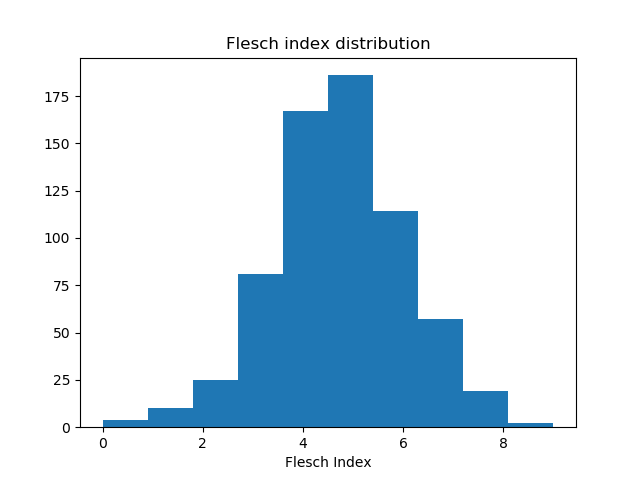
 The reding index is all below 10 which means all the bulletins are college level when it comes to readability.
 Lets see how that constrasts with college requirements
 ```python

 tot=df['SCHOOL_TYPE'].shape[0]
x1=round(df[df['SCHOOL_TYPE']=='College or University'].shape[0]/tot*100)
x2=100-x1
plt.figure(figsize=(5,5))
plt.bar(height=[x1,x2],x=['College Degree','No College Degree'])
plt.show()

 ```
 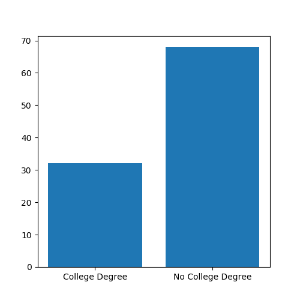
 #### Checking for promotions and similar jobs
 We can check for relevant promotions as following
 ```python

 def similar_jobs(job):
    ''' function to find and return jobs with similar job title.take a single argument
            - job title
            returns
                -list of similar jobs '''

    word1 = nltk.tokenize.word_tokenize(job)
    jobs = []
    for i, name in enumerate(df['Position']):
        word2 = nltk.tokenize.word_tokenize(name)
        # print(word2)
        # print(set(nltk.ngrams(word2, n=1)))
        distance = nltk.jaccard_distance(set(nltk.ngrams(word1, n=1)), set(nltk.ngrams(word2, n=1)))
        if distance < .4:
            jobs.append((name, i))
    return jobs


 promotions=list()
for name in df['Position']:
    z=re.match(r'\w*\s*\w*\s*(supervisor|manager|specialist|senior)\s*\w*\s*\w*$',name)
    if z is not None:
        promotions.append(name)
       # print(name)
positions=list()
for y in promotions:
    z=re.sub(r'\s?(supervisor|manager|specialist|senior)\s?$',"",str(y))
    positions.append(z)
lowers=list()
print(positions)
for name in df['Position']:
    for check in positions:
        if name.find(check)!=-1 and name not in promotions and name not in lowers:
            lowers.append(name)
print(lowers)

listprom=pd.DataFrame(columns=['start','promotion','salary'])
for pos in df['Position']:
    promotioner = list()
    salprom = list()
    sim=similar_jobs(pos)
    sal=df.loc[df['Position']==pos,'salary_start'].iloc[0]
    #print('sal=')
   # print(sal)
    if sim is not None:
      for name,index in sim:
     #     print(df.loc[index,'salary_start'])
          if int(df.loc[index,'salary_start'])>int(sal):
              promotioner.append(name)
              salprom.append(df.loc[index,'salary_start'])
               # print(promotioner)
    df2=pd.DataFrame({'promotion':promotioner})
    df2['salary']=salprom
    df2['start']=pos
    #display(df2)
     listprom=listprom.append(df2)
print(listprom.shape)
listprom=listprom.reset_index(drop=True)
 ```
  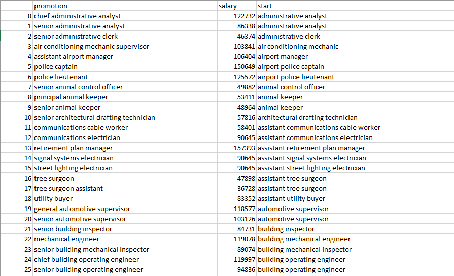
  The picture above shows an example from the job bulletins
 Also jobs with similar equirements can be found as following:
 ```python

 def similar_req(job):
    ''' function to find and return jobs with similar job title.take a single argument
            - job title
            returns
                -list of similar jobs '''

    word1 = nltk.tokenize.word_tokenize(job)
    jobs = []
    for i, name in enumerate(df['requirements']):
        word2 = nltk.tokenize.word_tokenize(name)
        distance = nltk.jaccard_distance(set(nltk.ngrams(word1, n=1)), set(nltk.ngrams(word2, n=1)))
        if (distance < .5):
            jobs.append((name, df.iloc[i]['Position']))
    return jobs
print(similar_req(df['requirements'][10]))

[('chief of drafting operations', 117), ('chief of operations', 118)]
 ```
this way applicants applying for one job can know about other jobs with similar requirements making them easier to access

## Conclusions

1.After estimating the sectors of jobs it was found out that the diversity in the job market is mostly dominated by the engineering and services sectors<br/>
2.Salary distribution is inline with the american middle class<br/>
3.the highest paying jobs are in the services sector and shipping and port management<br/>
4.greatest pay rise without a promotion can be achieved generally in the supervisor position<br/>
5.There is no shortage of job opportunities in LA with job listings rising at an exponential level since 2016<br/>
6.the rise in job listings is largely contributed to by the largest job sectors<br/>
7.The fastest growing job sectors are the most dominant<br/>
8.Experience of at least two years is demanded by the majority of job listings<br/>
9.Experience is valued higher than a college degree with almost all jobs requiring some sort of experience where as only a third require a college degree of some sort<br/>
10. job listings are distributed mostly evenly across the year<br/>
11.checking the requirements of the jobs mostly shows previous experience as the most dominant requirement<br/>
12.most jobs require an essay along with an interview for the screening process whereas essay, interview and tests(multiple choice etc) being the most common selection processes<br/>
13.the pronouns used in the job bulletins are all gender nuetral<br/>
14. No gender biased job titles are use like "fire man","police man" etc.<br/>

## Suggestions

1.More no collar jobs need to be introduced as the job market seems lacking in that area.<br/>
2. The most succesful economies are ones where the job market is diverse. The LA Job market seems to be largely dominated by 1 or 2 sectors. Diversity in the job market needs to be introduced.<br/>
3. Almost all jobs require previous experience which discourages fresh graduates and keeps them out of the job market.<br/>
4. Most jobs have 2 to 3 screening procedures which limits potential candidates. They should be reduced to just a face to face interview.<br/>
5. the bulletins have reading difficulty of a college graduate whereas two thirds of them donot require a college degree. The bulletins should be constructed with simpler language<br/>
6. the city of LA can use the promotions function to find out the promotions available to each job listing<br/>
7. the city of LA can use the similar requirents function to find similar jobs so as people applying for one job can find out other that they might be eligible to aswell<br/>
8. All job bulletins need to have a closing date specified as to avoid confusion <br/>
## Acknowledgments

* shahules kernel on kaggle
